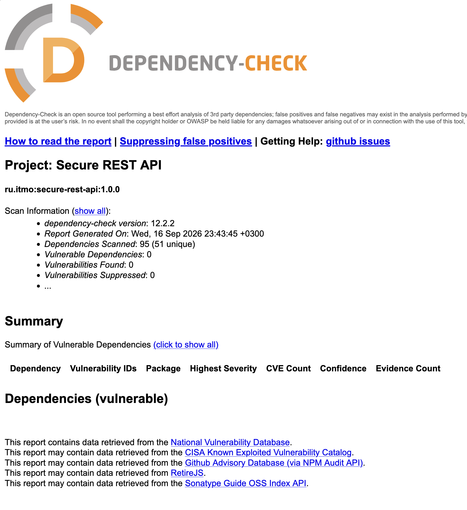
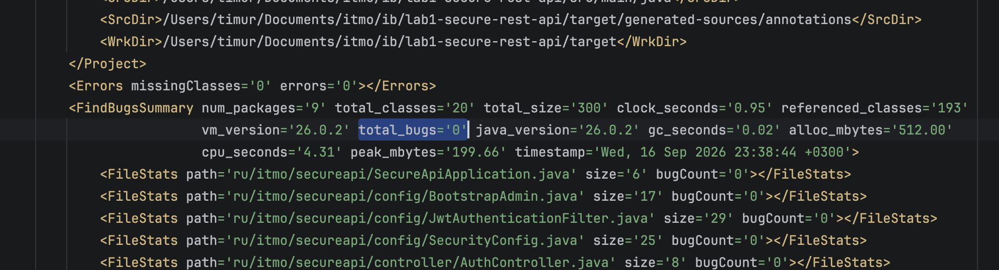

# Информационная безопасность

## Лабораторная работа №1

### Стек

- Java 21 / Spring Boot 4
- Hibernate / Spring Data JPA
- SQLite

### Описание API

`POST /auth/login`: метод для аутентификации пользователя (принимает имя пользователя и пароль).
```json
{
    "username": "admin",
    "password": "password"
}
```

`GET /api/data`: метод для получения данных. Доступ только у аутентифицированных пользователей с JWT-токеном.

`POST /api/data`: метод для создания записи. Доступ только у аутентифицированных пользователей с JWT-токеном.
```json
{
    "title": "Example",
    "content": "Protected data"
}
```

### Описание реализованных мер защиты

- От **SQLi** код защищён с помощью ORM Hibernate и параметризованных запросов Spring Data JPA.
- От **XSS** защищён с помощью очистки пользовательских данных через OWASP Java HTML Sanitizer.
```java
private final PolicyFactory plainTextPolicy = new HtmlPolicyBuilder().toFactory();

public String sanitize(String untrustedText) {
    return plainTextPolicy.sanitize(untrustedText).strip();
}
```
```java
String safeTitle = sanitizer.sanitize(request.title());
String safeContent = sanitizer.sanitize(request.content());
DataItem saved = items.save(new DataItem(
        safeTitle,
        safeContent,
        username,
        Instant.now()));
```

### Отчёты из pipeline

Dependency-Check:



SpotBugs:


